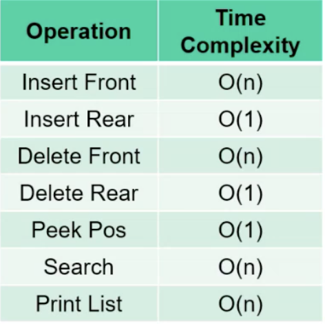
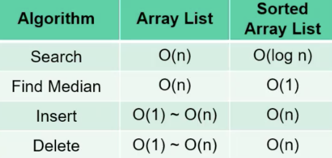
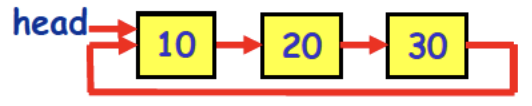
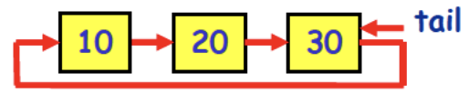
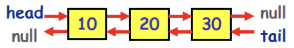
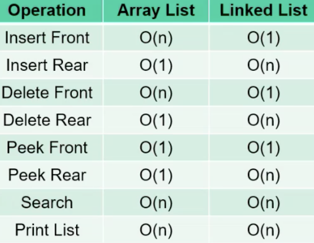

## List
- 추상 자료형
- 중복 가능
- 순서 중요
- Linear data structure
#### ✅ Main Operations
Insert: 0~length  
Delete: 0~length-1  
Peek: 0~length-1  
Is List Empty?  
그외: Search Element with Key, Print List, Is List Full?, Insert Front, Insert Rear, Delete Front, Delete Rear  

#### ✅ Sorted List(array로 구현된)
  

주요 기능: Insert, Delete, Search, Is List Empty?  
특징: 탐색, 중앙값 찾기가 매우 빠름 O(1)  
## Linked list
- 포인터로 다음걸 연결
- 각각의 Node는 Data와 Link로 구성됨
  
#### ✅ 종류
Linked List  
  
Circular Linked List  
- head pointer  
  
- tail pointer  
  

Doubly Linked List  
  
#### ✅ 주요 기능
Insert: 0~length  
Delete: 0~length-1  
Peek: 0~length-1  
Is List Empty?  
IsFull은 없음 ➡️ 컴퓨터의 메모리 한도 내에서 계속 연장 가능  
#### ✅ 시간복잡도
  

Sorted Linked List: 일반적으로는 정렬을 해놔도 처음부터 가야돼서 탐색에 O(n)이 걸림 ➡️ Skip List 사용   
