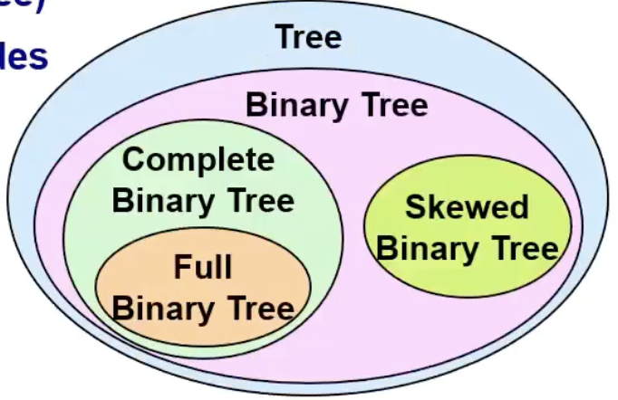
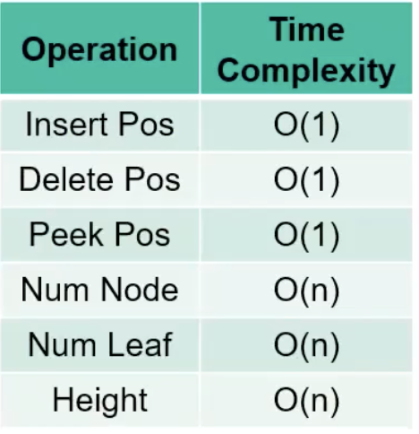
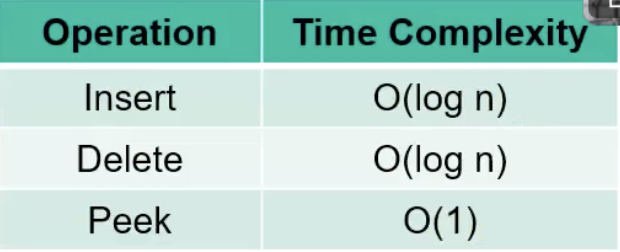
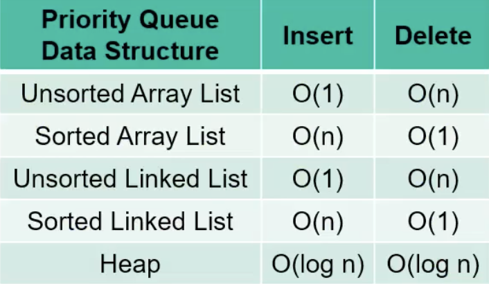

## Tree
#### ✅ 용어
Root: 트리의 첫번째 노드  
Leaf Node(External node): 자식노드가 없는 노드  
Internal Node: 자식노드가 있는 노드  
Subtree: 트리의 부분적인 트리  
Forest: 여러 트리의 집합  
Degree of Node: 각 노드에서 자식의 수  
Degree of Tree: 자식이 가장 많은 노드의 자식의 수  
M-ary Tree: 최대 M개의 자식을 가지고있음  
Binary Tree: 자식이 최대 2개  
Full Binary Tree: leaf 노드를 제외하고 자식이 2개씩 전부 가득 차 있음  
Complete Binary Tree: 마지막 level을 제외하고 가득 차 있고 마지막 level은 왼쪽부터 채워짐(배열로 구현했을 때 중간에 공백이 없음)  
Skewed Binary Tree: 자식이 전부 하나만 있음  

#### ✅ Array Tree
- 0번지는 사용 안 함  
- 높이가 h일 때 배열의 크기: 2^h  
  Index: 1 ~ 2^h - 1  
- 자식노드의 인덱스가 i일 때 부모 노드의 인덱스: i / 2  
- 부모노드의 인덱스가 i일 때 왼쪽 자식 노드: 2i, 오른쪽 자식노드: 2i + 1  
- 주요기능: Insert, Delete, Peek, Count # of Nodes, Count # of Leaf Nodes, Find Height  
- Count # of Nodes: 
  ```cpp 
  return 1 + NumNode(left) + NumNode(right);
  ```
- Count # of Leaf Nodes: 
  ```cpp
  if(IsLeaf(pos)) return 1;
  return NumLeaf(left) + NumLeaf(right);
  ```
- Height of Tree: 
  ```cpp
  return 1 + max(Height(left), Height(right));
  ```
#### ✅ 시간복잡도
  

#### ✅ Heap
- Max-Heap: 부모가 자식보다 항상 값이 크거나 같음
- Min-Heap: 부모가 자식보다 항상 값이 자거나 같음  
- Partly sorted  
- 주요기능: Insert, Delete, Peek, Is Empty?
- 시간복잡도  
 

#### ✅ 우선순위 큐 종류별 시간복잡도
 

